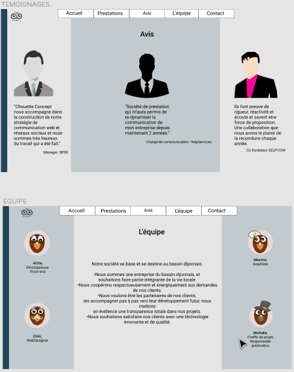

Création d'un site pour l'agence web, fictive, Chouette Concept.
Ce site sert à présenter l'agence, l'équipe, leurs prestations.
Il s'agit d'un projet de formation collaboratif. Ce premier projet a été conçu pour nous permettre de découvrir la création d'une charte graphique, de pratiquer du HTML et du CSS, de faire nos premiers dépôts sur GitHub  et d'appréhender le travail en équipe.

### Membres de l'équipe travaillant sur le projet

 - [AureliaHt](https://github.com/AureliaHt)
 - [Fouzi92](https://github.com/Fouzi92)
 - [Nexus8th](https://github.com/Nexus8th)
 - Kuchx

### Wireframe, Maquette et prototype.

L'ensemble a été réalisé par un autre groupe de la formation sur FIGMA. 

### Eléments et attributs

Apprentissage et intérêt porté sur grid et flexbox, ainsi que sur la responsivité des pages avec les media queries.